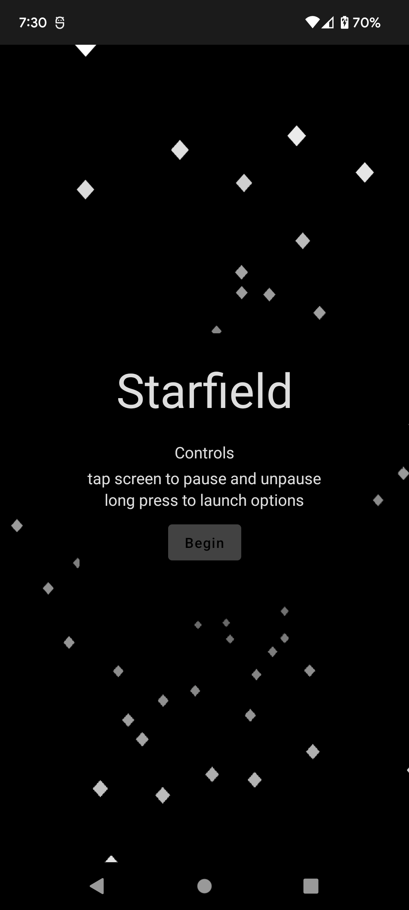
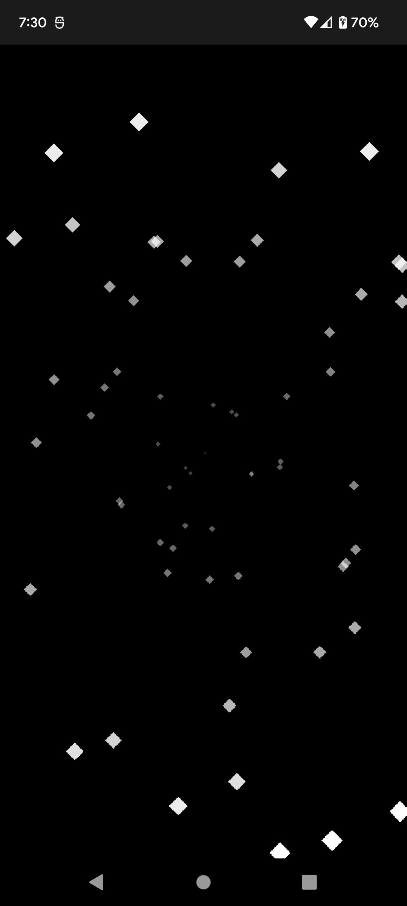
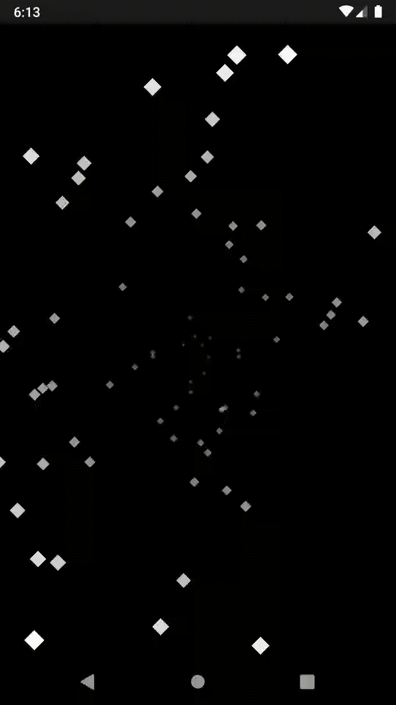

# Starfield (WIP)

## Description

The Starfield app is just a learning experience playing with compose and following the the Jetpack Compose State Codelab.

This is not meant to be a good example of using compose, or in anyway a good example of a use for compose. This is just me, having an idea, and seeing if it could be be done. 

## Design Choices

The screen is mapped out as a circle, with middle of screen to corner being radius. This allows for smooth movement of stars from center out uniformly. This does result in stars being drawn off screen for a period, but made for easier calculation and overall design.

## Screenshots

I come back to this every now and then when I want to make some quick changes, so the screenshots may not be

## Gif

