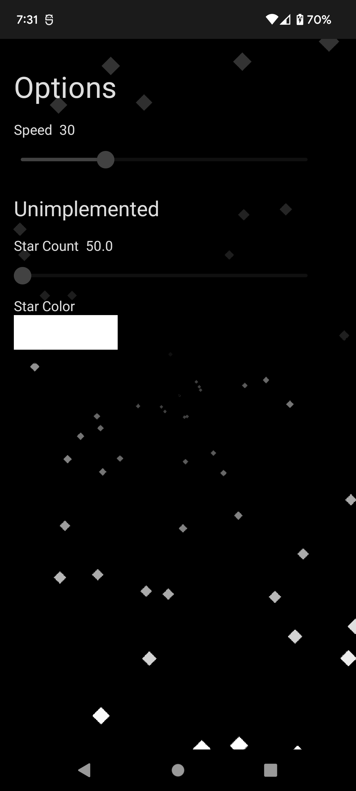

# Starfield (App)

 

The Starfield app is reminiscent of the old starfield screensaver from Windows 3.1 and written in compose.

## About

The Starfield app is just a learning experience playing with compose and following the the Jetpack Compose State Codelab.

This is not meant to be a good example of using compose, or in anyway a good example of a use for compose. This is just me, having an idea, and seeing if it could be be done. 

Currently there is the ability to change pause/unpause, launch the config menu, and change speed. Future changes would be to change star quantity and color, as well as possible star shape.

## Design Choices

The screen is mapped out as a circle, with middle of screen to corner being radius. This allows for smooth movement of stars from center out uniformly. This does result in stars being drawn off screen for a period, but made for far easier calculation and overall design.

## Screenshots

### Intro And Options Screen

### Different Speeds

## Practice Technologies

- **Compose**
- **State**
- **Math!**

## Future Considerations

Since this app has no practical use, it is hard to justify coming back to update even more, so for the time being it is being shelfed over more important learning opportunities

I would though in the future like to update and implement the options in the future. Adding different stars would be easy enough, and possibly getting an external library or just random button for star color would be simple too. Even adding the ability to change quantity should follow the same method for the already implemented star speed. For now though, it sits as is.